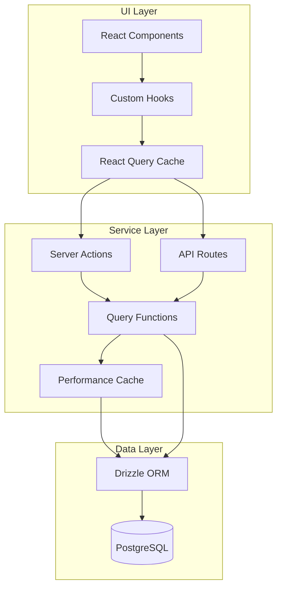
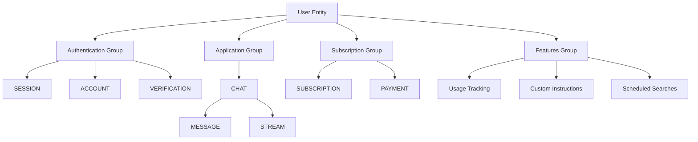
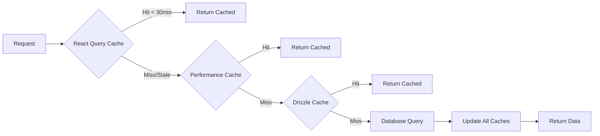

# Data Model Documentation

## Overview

This directory contains comprehensive Entity Relationship Diagrams (ERDs) and data model documentation for the Mylo Travel Concierge application. The documentation is organized into three main layers:

1. **Database Schema** - PostgreSQL tables and relationships
2. **Service Layer** - Business logic and data access patterns
3. **UI Data Models** - React Query hooks and client-side state management

## Quick Navigation

### 📊 [Database Schema ERD](./database-schema.md)
**Purpose**: Complete database structure with all tables, relationships, and constraints.

**Contents**:
- Authentication & user management tables
- Core application data (chats, messages, streams)
- Subscription & payment tracking
- Usage monitoring (rate limiting)
- Feature tables (custom instructions, lookouts)
- Complete relationship diagrams
- Index strategies
- Data retention policies

**When to use**: 
- Designing new database features
- Understanding data relationships
- Planning migrations
- Debugging data integrity issues

---

### 🔧 [Service Layer Models](./service-models.md)
**Purpose**: Business logic layer that abstracts database operations.

**Contents**:
- Service architecture overview
- User service operations
- Chat and message management
- Subscription and payment services
- Usage tracking services
- Lookout scheduling service
- Caching strategies
- Error handling patterns
- Service data flows

**When to use**:
- Implementing new server actions
- Understanding business logic
- Optimizing query patterns
- Designing new features
- Debugging service-level issues

---

### 🎨 [UI Data Models](./ui-data-models.md)
**Purpose**: Client-side state management and data fetching patterns.

**Contents**:
- React Query hooks architecture
- Type system (messages, tools, attachments)
- `useUserData` hook for authentication
- `useUsageData` hook for rate limiting
- `useLookouts` hook for scheduled searches
- Optimistic update patterns
- Caching strategies
- Performance optimizations
- Error handling in UI

**When to use**:
- Building new UI components
- Managing client-side state
- Implementing real-time updates
- Optimizing render performance
- Understanding data flow from server to UI

---

## Architecture Layers



### Layer Responsibilities

| Layer | Responsibility | Key Technologies |
|-------|---------------|------------------|
| **UI Layer** | User interaction, display, client state | React, React Query, TypeScript |
| **Service Layer** | Business logic, validation, caching | Server Actions, Query Functions, Cache Layer |
| **Data Layer** | Data persistence, relationships, constraints | PostgreSQL, Drizzle ORM |

---

## Key Concepts

### 1. Entity Relationships

The application has several core entity groups:



**Authentication Group**: User identity and session management  
**Application Group**: Core chat functionality  
**Subscription Group**: Payment and subscription tracking  
**Features Group**: Advanced features and customization

### 2. Data Flow Patterns

#### Read Path (Query)
```
UI Component → React Query Hook → Query Cache Check → Server Action → Service Function → Database → Response Flow Back
```

#### Write Path (Mutation)
```
UI Component → React Query Mutation → Optimistic Update → Server Action → Service Function → Database → Cache Invalidation → Refetch
```

#### Real-time Updates
```
Database Change → QStash Trigger → Webhook Handler → Service Function → Database Update → UI Poll → React Query Cache → Component Re-render
```

### 3. Caching Strategy

The application uses multi-level caching:



**Cache Layers**:
1. **React Query Cache** (Client-side) - 30 minutes to 1 hour
2. **Performance Cache** (Server-side) - For frequently accessed data
3. **Drizzle Cache** (ORM level) - Short-lived query caching

---

## Common Patterns

### 1. Optimistic Updates

Used in `useLookouts` for instant UI feedback:

```typescript
onMutate: async (variables) => {
  await queryClient.cancelQueries({ queryKey });
  const previousData = queryClient.getQueryData(queryKey);
  queryClient.setQueryData(queryKey, optimisticData);
  return { previousData };
},
onError: (err, variables, context) => {
  queryClient.setQueryData(queryKey, context.previousData);
}
```

### 2. Cascade Deletes

Database-level cascade ensures data integrity:
- Delete user → Deletes sessions, accounts, chats, usage, etc.
- Delete chat → Deletes messages and streams

### 3. Usage Tracking

Rate limiting pattern:
1. Check current usage via `useUsageData`
2. Compare against limits (pro user or free tier)
3. Allow/deny request
4. Increment usage counter
5. Invalidate cache for real-time updates

---

## Data Model Conventions

### Naming Conventions

**Tables**: Singular lowercase (e.g., `user`, `chat`, `message`)  
**Primary Keys**: Always `id` of type `text`  
**Foreign Keys**: `{entity}_id` format (e.g., `user_id`, `chat_id`)  
**Timestamps**: `created_at`, `updated_at`, `expires_at`, etc.  
**Enums**: Descriptive text fields with enum constraint in code

### ID Generation

- **User IDs**: Generated by auth provider
- **Chat/Message IDs**: UUID v4 or `generateId()` from AI SDK
- **Stream IDs**: `generateId()` from AI SDK

### JSON Fields

Used for complex or flexible data structures:
- `message.parts` - Message content chunks
- `message.attachments` - File attachments
- `payment.metadata` - Flexible payment data
- `lookout.runHistory` - Array of run records

---

## Related Documentation

### Internal Docs
- [Stack Overview](../STACK.md) - Technology stack details
- [Workflows](../workflows/) - Development workflows
- [Patterns](../patterns/) - Code patterns and best practices

### Code References
- [Database Schema](../../lib/db/schema.ts) - TypeScript schema definitions
- [Query Functions](../../lib/db/queries.ts) - Service layer implementation
- [Type Definitions](../../lib/types.ts) - TypeScript types
- [Custom Hooks](../../hooks/) - React Query hooks

### External Resources
- [Drizzle ORM Documentation](https://orm.drizzle.team/)
- [React Query Documentation](https://tanstack.com/query/latest)
- [PostgreSQL Documentation](https://www.postgresql.org/docs/)

---

## Maintenance

### Updating Documentation

When making changes to the data model:

1. **Database Changes**: Update `database-schema.md` with new tables/relationships
2. **Service Changes**: Update `service-models.md` with new query patterns
3. **UI Changes**: Update `ui-data-models.md` with new hooks or types
4. **Generate ERDs**: Ensure all Mermaid diagrams are up to date

### Migration Process

1. Update schema in `lib/db/schema.ts`
2. Generate migration: `pnpm drizzle-kit generate`
3. Review migration in `drizzle/migrations/`
4. Apply migration: `pnpm drizzle-kit migrate`
5. Update documentation
6. Update TypeScript types if needed

---

## FAQ

### Q: Where do I start when adding a new feature?

**A**: Follow this order:
1. Design database schema (if needed) → Update `database-schema.md`
2. Implement service functions → Update `service-models.md`
3. Create React hooks → Update `ui-data-models.md`
4. Build UI components

### Q: How do I handle relationships between tables?

**A**: Use Drizzle's `.references()` method with cascade delete where appropriate. See examples in `database-schema.md`.

### Q: When should I use optimistic updates?

**A**: Use for actions where immediate feedback improves UX and rollback is simple (status toggles, deletions). Avoid for complex operations with side effects.

### Q: How do I debug data flow issues?

**A**: 
1. Check React Query DevTools for cache state
2. Review server actions for correct query calls
3. Check database directly with Drizzle Studio
4. Review console logs in service functions

### Q: What's the difference between staleTime and gcTime in React Query?

**A**: 
- `staleTime`: How long data is considered fresh (no refetch needed)
- `gcTime` (formerly cacheTime): How long unused data stays in cache before garbage collection

---

## Contributing

When contributing to the data model:

1. **Follow existing patterns** - Maintain consistency with current architecture
2. **Update all three docs** - Keep database, service, and UI docs in sync
3. **Add Mermaid diagrams** - Visual representations help understanding
4. **Document caching strategy** - Specify staleTime, gcTime, refetch rules
5. **Include examples** - Show common usage patterns
6. **Test thoroughly** - Verify data integrity and performance

---

## Glossary

**ERD**: Entity Relationship Diagram - Visual representation of database structure  
**FK**: Foreign Key - Reference to another table's primary key  
**PK**: Primary Key - Unique identifier for a table row  
**UK**: Unique Key - Field that must have unique values  
**CASCADE DELETE**: Automatic deletion of related records when parent is deleted  
**Optimistic Update**: UI update before server confirmation  
**Stale Data**: Cached data that may be outdated  
**Query Invalidation**: Marking cached data as stale to trigger refetch  
**Server Action**: Next.js server-side function callable from client  
**React Query**: TanStack Query - Data fetching and caching library

---

**Last Updated**: 2025-10-30  
**Maintainers**: Development Team  
**Version**: 1.0.0
