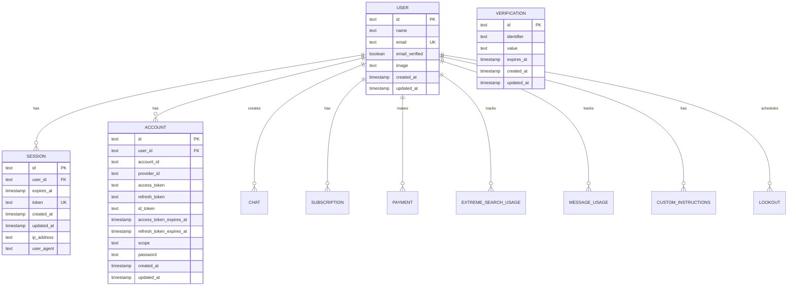
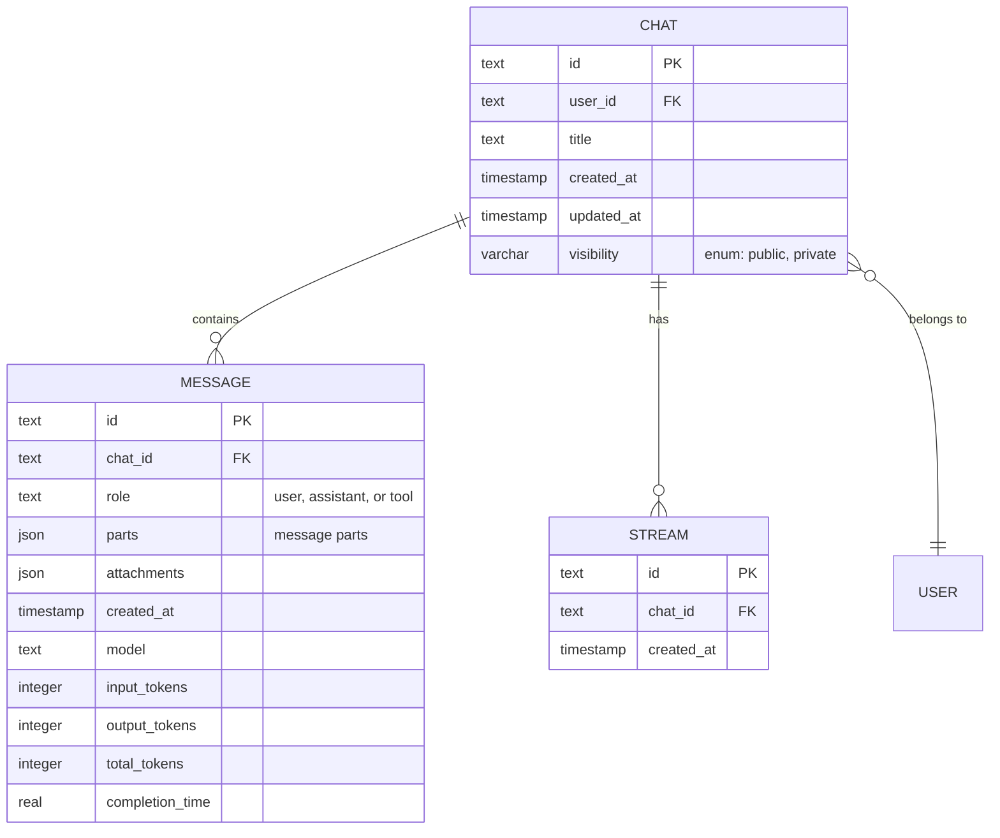
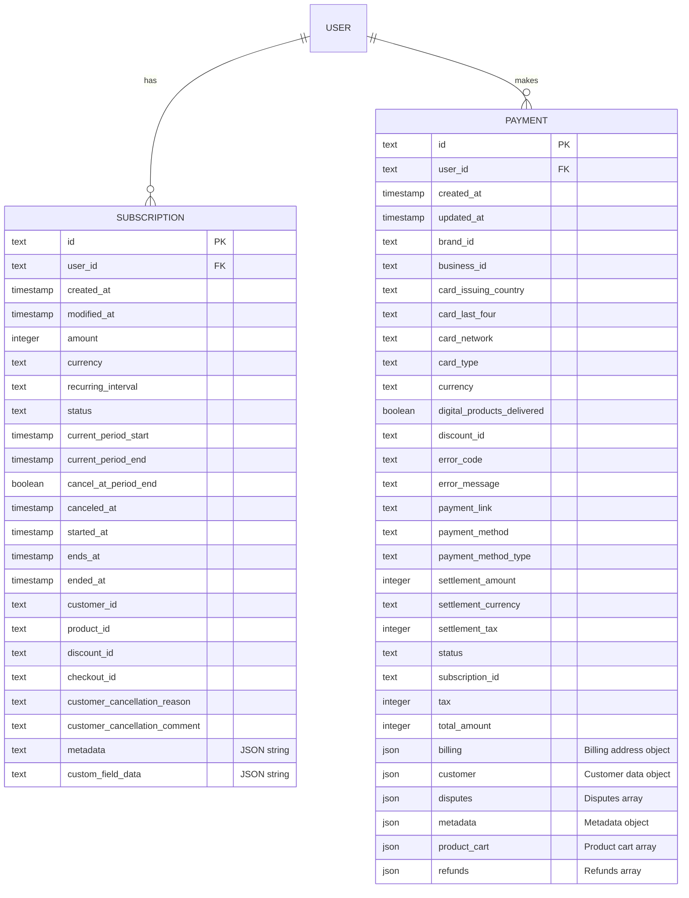
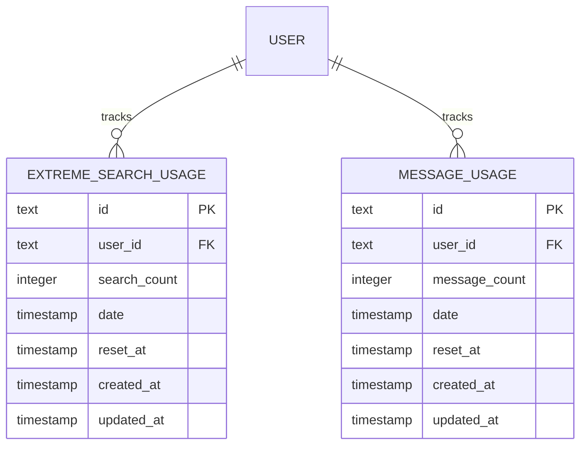
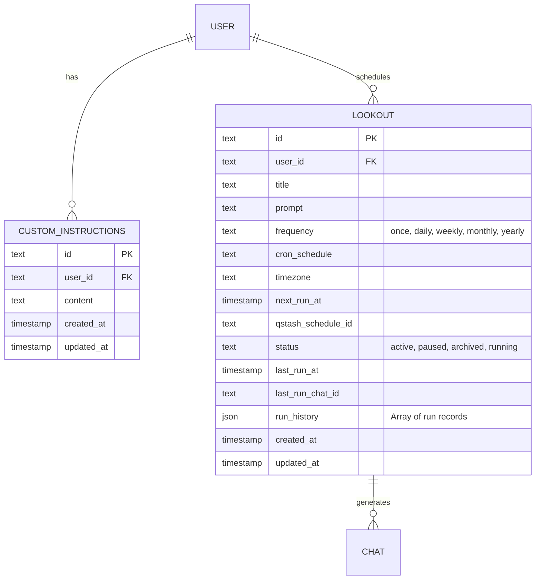
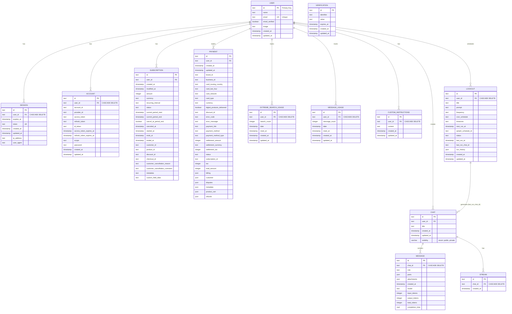

# Database Schema - Entity Relationship Diagram

## Overview

This document provides a comprehensive view of the database schema for the Mylo Travel Concierge application. The schema is managed using Drizzle ORM with PostgreSQL as the underlying database.

## Core Entities

### Authentication & User Management

### Core Application Data

### Subscription & Payment Management

### Usage Tracking

### Features

## Complete Schema Overview

## Key Relationships

### Authentication Flow
- **USER** → **SESSION**: One-to-many relationship with cascade delete
- **USER** → **ACCOUNT**: One-to-many relationship for multiple OAuth providers with cascade delete
- **VERIFICATION**: Standalone table for email/phone verification tokens

### Core Application
- **USER** → **CHAT**: Users can create multiple chats
- **CHAT** → **MESSAGE**: Chats contain multiple messages with cascade delete
- **CHAT** → **STREAM**: Chats track active streams with cascade delete

### Subscription & Billing
- **USER** → **SUBSCRIPTION**: Users can have subscriptions (Polar webhooks)
- **USER** → **PAYMENT**: Users can make payments (Dodo Payments webhooks)

### Usage Tracking
- **USER** → **EXTREME_SEARCH_USAGE**: Monthly search usage tracking with cascade delete
- **USER** → **MESSAGE_USAGE**: Daily message usage tracking with cascade delete

### Features
- **USER** → **CUSTOM_INSTRUCTIONS**: One-to-one relationship for custom AI instructions with cascade delete
- **USER** → **LOOKOUT**: Users can schedule multiple automated searches with cascade delete
- **LOOKOUT** → **CHAT**: Lookouts reference the last chat they generated

## Data Types Reference

### Primary Types
- **text**: Variable-length text field
- **timestamp**: PostgreSQL timestamp with time zone
- **boolean**: True/false values
- **integer**: 4-byte integer
- **real**: Single-precision floating point
- **json**: JSON data type for complex objects
- **varchar(enum)**: Enumerated text values

### Constraints
- **PK**: Primary Key
- **FK**: Foreign Key
- **UK**: Unique Key
- **CASCADE DELETE**: Foreign key with cascade delete on parent deletion

## Indexes

Indexes are defined in `create_indexes.sql` to optimize common queries:

1. **User lookups**: `user.email`
2. **Session validation**: `session.token`
3. **Chat queries**: `chat.user_id`, `chat.created_at`
4. **Message queries**: `message.chat_id`, `message.created_at`
5. **Usage tracking**: `message_usage.user_id + date`, `extreme_search_usage.user_id + date`
6. **Lookout queries**: `lookout.user_id`, `lookout.status`, `lookout.next_run_at`

## Data Retention & Cleanup

### Automatic Cleanup
- **Message Usage**: Previous day entries cleaned on daily reset
- **Sessions**: Expired sessions should be cleaned periodically
- **Lookout History**: Limited to last 100 runs per lookout

### Cascade Deletes
When a user is deleted:
- All sessions are deleted
- All accounts are deleted
- All extreme search usage records are deleted
- All message usage records are deleted
- All custom instructions are deleted
- All lookouts are deleted

When a chat is deleted:
- All messages in the chat are deleted
- All streams for the chat are deleted

## Schema File Locations

- **Schema Definition**: `lib/db/schema.ts`
- **Migrations**: `drizzle/migrations/`
- **Queries**: `lib/db/queries.ts`
- **Configuration**: `drizzle.config.ts`
- **Type Exports**: All tables export TypeScript types via `InferSelectModel`
