# Service Layer Models

## Overview

This document describes the service layer architecture, including data access patterns, business logic, and service interactions. The service layer is implemented in `lib/db/queries.ts` and provides an abstraction over the database schema.

## Architecture Overview

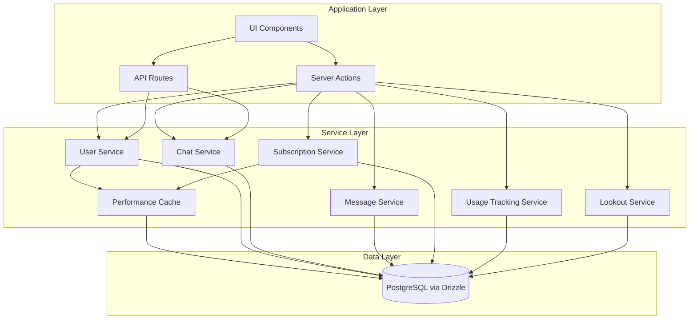

## Service Modules

### 1. User Service

**Purpose**: Manage user authentication, profile data, and user-related queries.

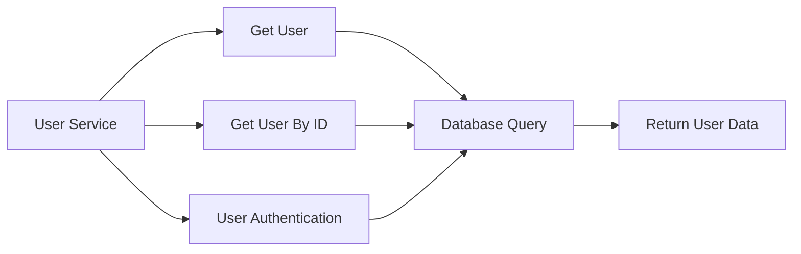

**Operations**:
- `getUser(email)`: Fetch user by email with caching
- `getUserById(id)`: Fetch user by ID with caching

**Caching**: User queries leverage Drizzle's `$withCache()` for performance.

**Error Handling**: All operations throw `ChatSDKError` with specific error codes.

---

### 2. Chat Service

**Purpose**: Manage chat creation, retrieval, updates, and deletion.

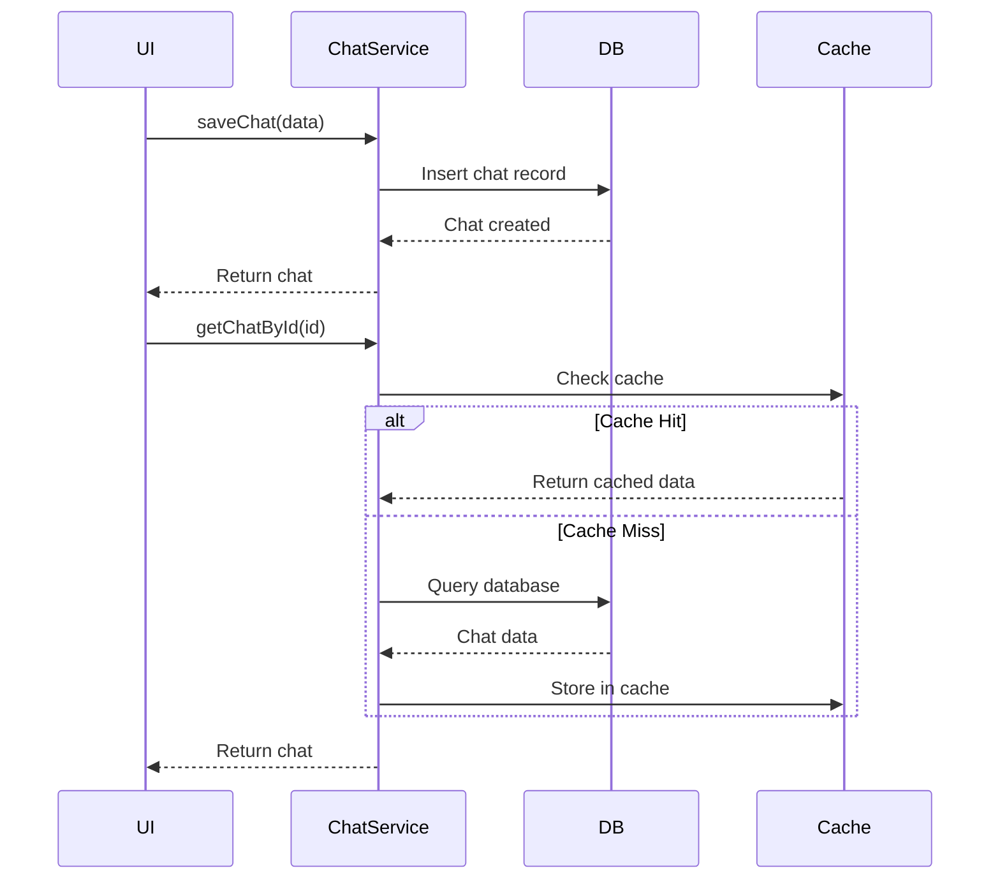

**Operations**:

**CRUD Operations**:
- `saveChat({id, userId, title, visibility})`: Create new chat
- `getChatById({id})`: Retrieve chat with caching
- `getChatWithUserById({id})`: Retrieve chat with user info joined
- `getChatsByUserId({id, limit, startingAfter, endingBefore})`: Paginated chat list
- `updateChatTitleById({chatId, title})`: Update chat title
- `updateChatVisibilityById({chatId, visibility})`: Update visibility (public/private)
- `deleteChatById({id})`: Delete chat and all related messages/streams

**Visibility Options**: `public` | `private`

**Pagination**: Cursor-based pagination using `startingAfter` and `endingBefore`

---

### 3. Message Service

**Purpose**: Handle message creation, retrieval, and deletion within chats.

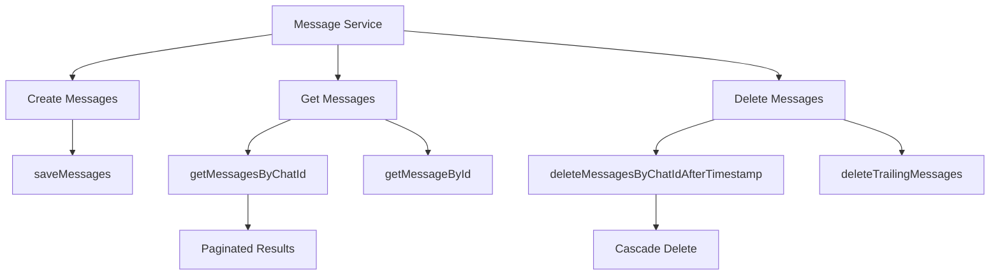

**Operations**:

**CRUD Operations**:
- `saveMessages({messages})`: Bulk insert messages
- `getMessagesByChatId({id, limit, offset})`: Paginated message retrieval
- `getMessageById({id})`: Single message retrieval
- `deleteMessagesByChatIdAfterTimestamp({chatId, timestamp})`: Delete messages after a timestamp
- `deleteTrailingMessages({id})`: Delete all messages after a specific message

**Message Structure**:
```typescript
{
  id: string,
  chatId: string,
  role: 'user' | 'assistant' | 'tool',
  parts: JSON,  // Message content parts
  attachments: JSON,
  createdAt: Date,
  model?: string,
  inputTokens?: number,
  outputTokens?: number,
  totalTokens?: number,
  completionTime?: number
}
```

**Pagination**: Offset-based pagination with default limit of 50 messages.

---

### 4. Stream Service

**Purpose**: Track active streaming responses for chats.

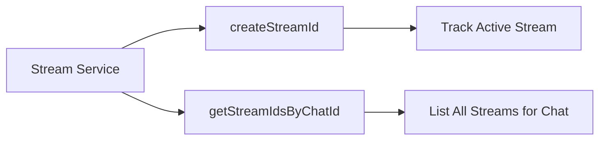

**Operations**:
- `createStreamId({streamId, chatId})`: Register a new stream
- `getStreamIdsByChatId({chatId})`: Get all stream IDs for a chat

**Use Case**: Track multiple concurrent streaming responses within a single chat.

---

### 5. Subscription Service

**Purpose**: Manage user subscriptions from Polar webhook data.

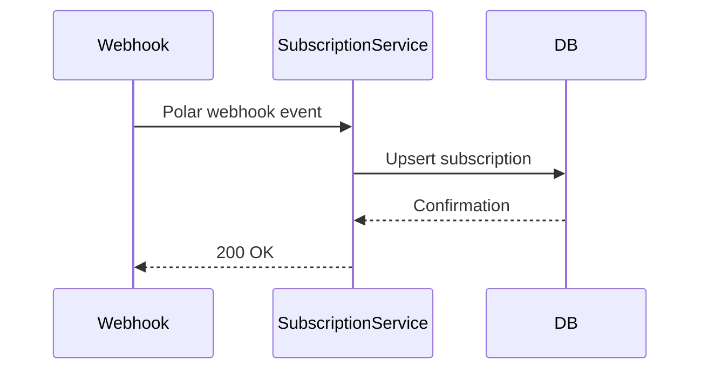

**Data Source**: Polar webhooks populate subscription data.

**Subscription States**:
- Active: User has an active subscription
- Canceled: Subscription is canceled but still active until period end
- Expired: Subscription has ended

**Fields Tracked**:
- Billing cycle (recurring interval, current period)
- Cancellation status and reason
- Product/discount information
- Custom metadata

---

### 6. Payment Service

**Purpose**: Process and track payments from Dodo Payments webhooks.

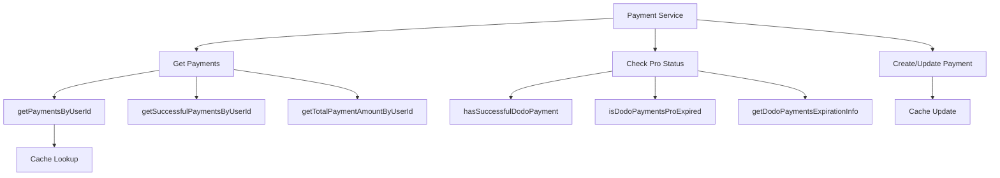

**Operations**:

**CRUD Operations**:
- `getPaymentsByUserId({userId})`: Get all payments with caching
- `getPaymentById({paymentId})`: Get single payment
- `getSuccessfulPaymentsByUserId({userId})`: Filter by status='succeeded'
- `getTotalPaymentAmountByUserId({userId})`: Sum of successful payments

**Pro Status Checks**:
- `hasSuccessfulDodoPayment({userId})`: Check if user has any successful payment
- `isDodoPaymentsProExpired({userId})`: Check if payment is older than 1 month
- `getDodoPaymentsExpirationInfo({userId})`: Get detailed expiration info

**Caching**:
- Uses `getDodoPayments()` and `setDodoPayments()` from performance cache
- Uses `getDodoProStatus()` and `setDodoProStatus()` for status checks

**Payment Lifecycle**:
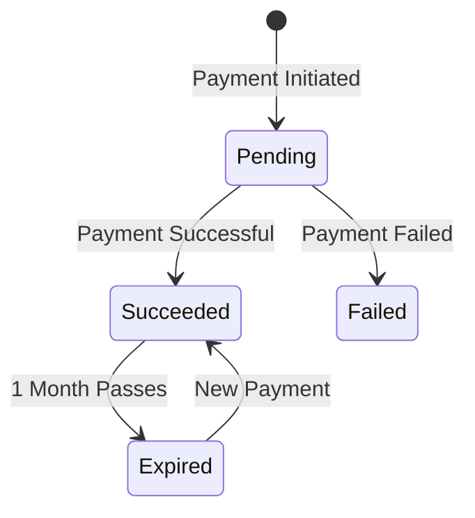

---

### 7. Usage Tracking Service

**Purpose**: Track and enforce usage limits for messages and extreme searches.

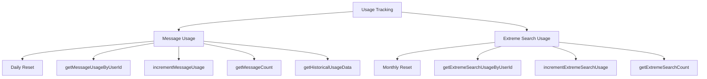

**Message Usage**:
- **Reset Frequency**: Daily at midnight
- **Cleanup**: Previous day entries auto-deleted on increment
- Operations:
  - `getMessageUsageByUserId({userId})`: Current day usage
  - `incrementMessageUsage({userId})`: Increment counter
  - `getMessageCount({userId})`: Get count for rate limiting
  - `getHistoricalUsageData({userId, months})`: Chart data from actual messages

**Extreme Search Usage**:
- **Reset Frequency**: Monthly (first day of next month)
- Operations:
  - `getExtremeSearchUsageByUserId({userId})`: Current month usage
  - `incrementExtremeSearchUsage({userId})`: Increment counter
  - `getExtremeSearchCount({userId})`: Get count for rate limiting

**Usage Flow**:
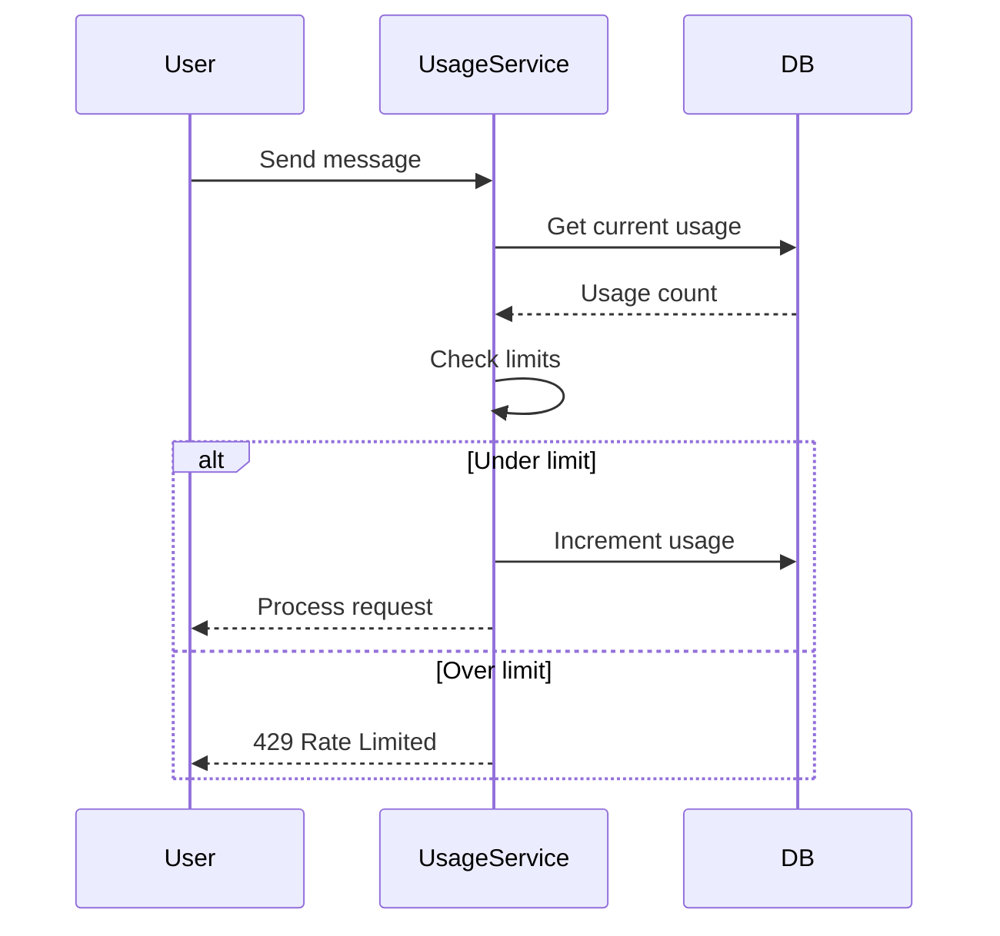

---

### 8. Lookout Service

**Purpose**: Manage scheduled automated searches and their execution history.

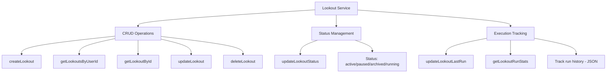

**Operations**:

**CRUD**:
- `createLookout({...})`: Create scheduled search
- `getLookoutsByUserId({userId})`: Get all user lookouts
- `getLookoutById({id})`: Get single lookout
- `updateLookout({id, ...})`: Update lookout configuration
- `deleteLookout({id})`: Remove lookout

**Status Management**:
- `updateLookoutStatus({id, status})`: Change status
- **Status Values**: `active`, `paused`, `archived`, `running`

**Execution Tracking**:
- `updateLookoutLastRun({id, lastRunAt, lastRunChatId, nextRunAt, ...})`: Log run completion
- `getLookoutRunStats({id})`: Get aggregated statistics

**Run History Structure**:
```typescript
{
  runAt: string,        // ISO date
  chatId: string,       // Generated chat ID
  status: 'success' | 'error' | 'timeout',
  error?: string,
  duration?: number,    // milliseconds
  tokensUsed?: number,
  searchesPerformed?: number
}
```

**Scheduling Flow**:
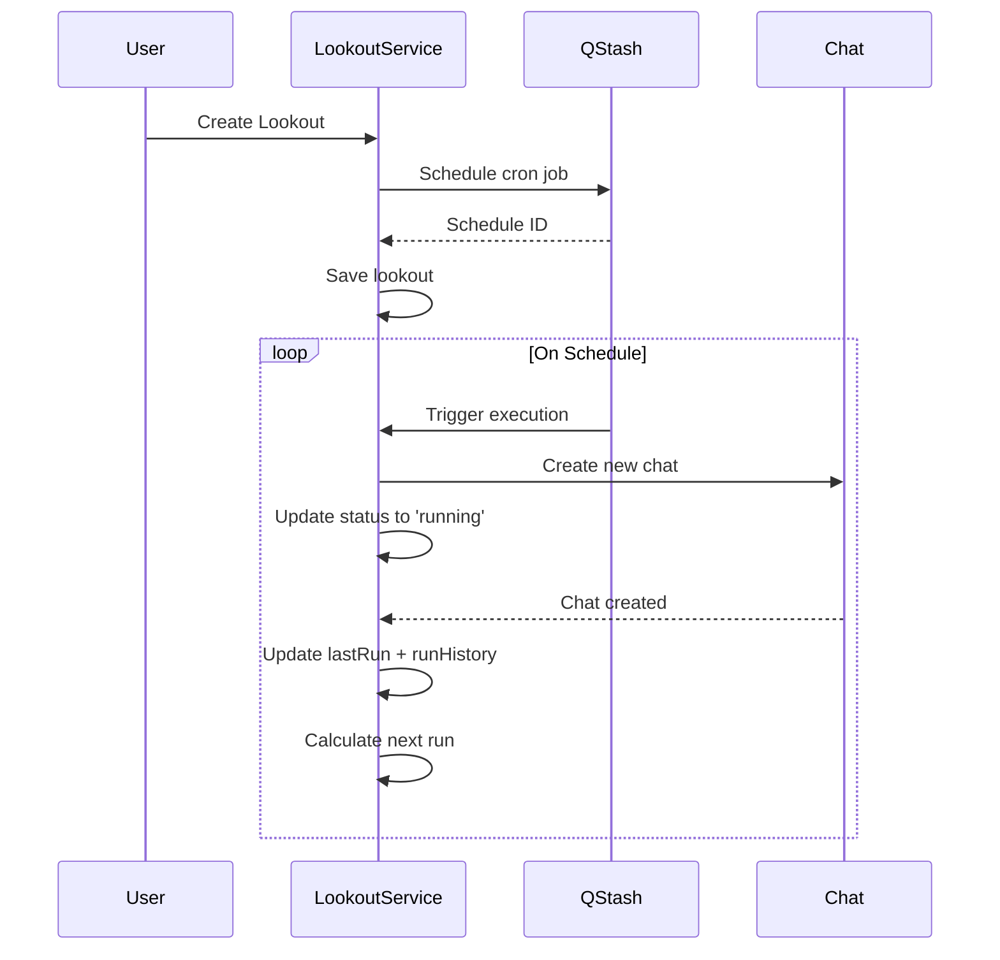

---

### 9. Custom Instructions Service

**Purpose**: Manage user-specific AI customization preferences.

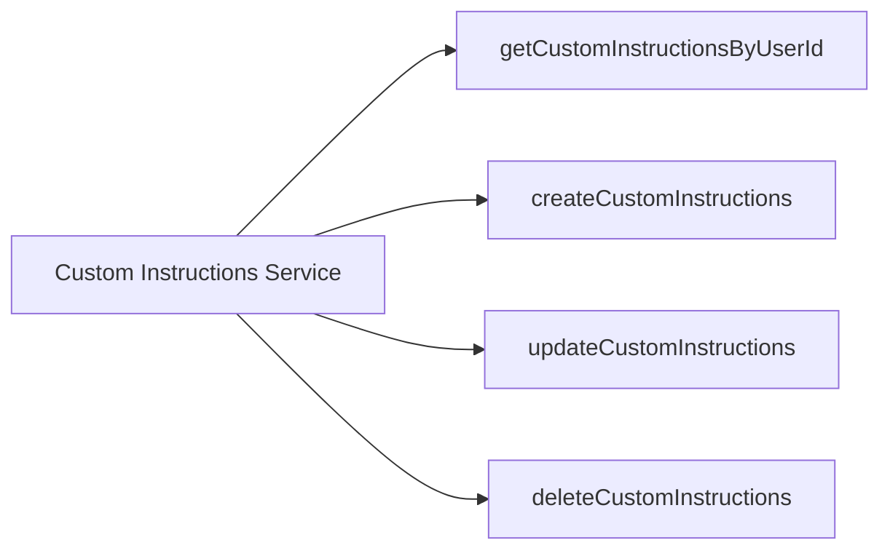

**Operations**:
- `getCustomInstructionsByUserId({userId})`: Get user's custom instructions (limit 1)
- `createCustomInstructions({userId, content})`: Create new instructions
- `updateCustomInstructions({userId, content})`: Update existing instructions
- `deleteCustomInstructions({userId})`: Remove instructions

**Use Case**: Users can provide persistent instructions that are included in every chat context.

---

## Error Handling

All service operations use a centralized error handling pattern:

```typescript
throw new ChatSDKError('bad_request:database', 'Descriptive error message')
```

**Error Types**:
- `bad_request:database`: Database query failures
- `not_found:database`: Resource not found
- Custom error codes for specific scenarios

## Caching Strategy

### 1. Drizzle Built-in Caching
- Uses `$withCache()` for frequently accessed queries
- Applied to: user lookups, chat retrieval, message fetching

### 2. Performance Cache Layer
Located in `lib/performance-cache.ts`:

**Payment Caching**:
- `getDodoPayments(userId)`: Get cached payments
- `setDodoPayments(userId, payments)`: Store payments
- `getDodoProStatus(userId)`: Get cached pro status
- `setDodoProStatus(userId, status)`: Store pro status

**Purpose**: Reduce database load for subscription/payment checks

### 3. React Query Caching
UI layer uses React Query for client-side caching (see UI Data Models doc)

## Service Data Flow

### Example: Message Creation Flow

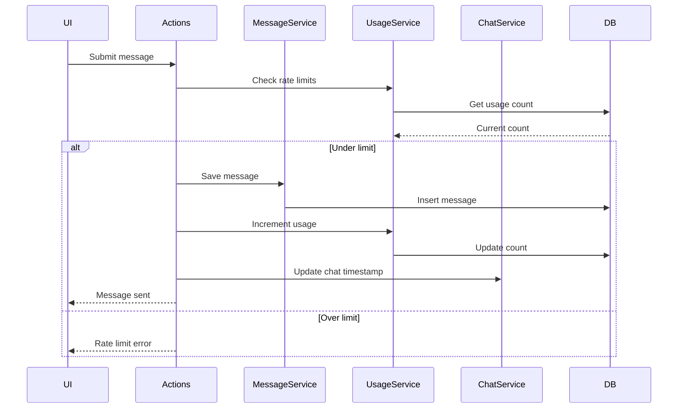

### Example: Subscription Check Flow

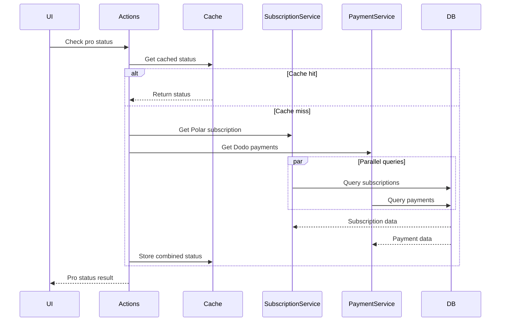

## Testing Considerations

- All service functions should be unit-testable
- Mock database layer using Drizzle mock utilities
- Test error handling paths
- Verify caching behavior
- Test cascade deletes
- Validate pagination logic

## Related Documentation

- [Database Schema ERD](./database-schema.md)
- [UI Data Models](./ui-data-models.md)
- [Performance Cache](../../lib/performance-cache.ts)
- [Error Handling](../../lib/errors.ts)
