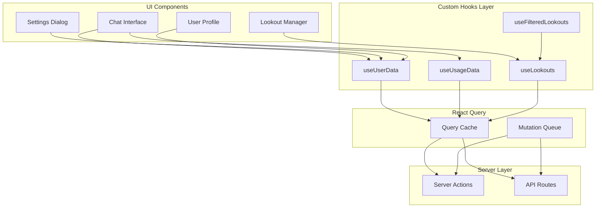
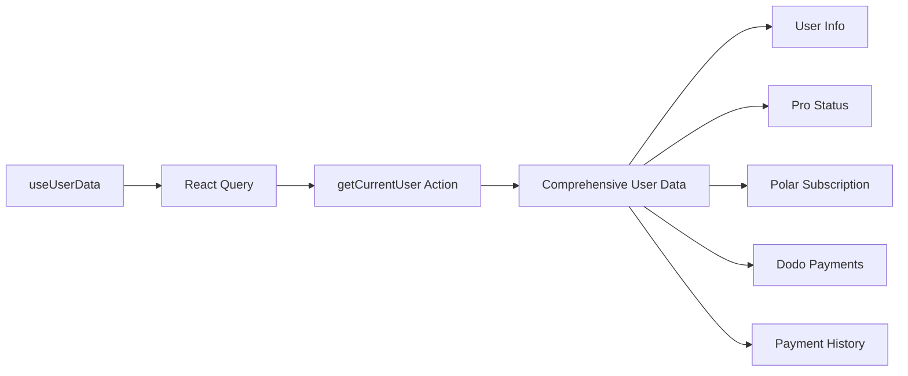
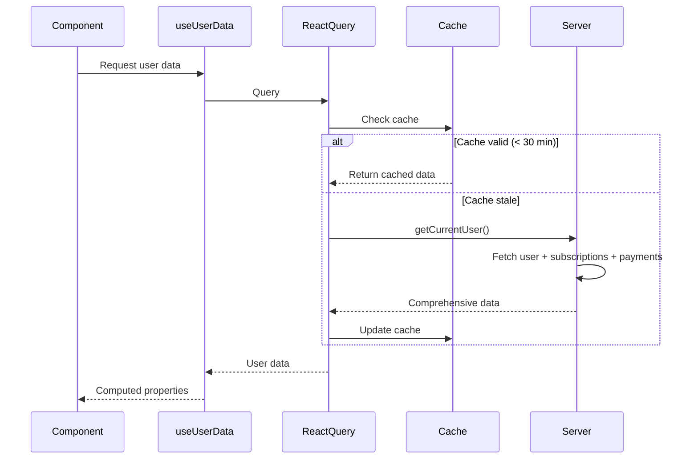
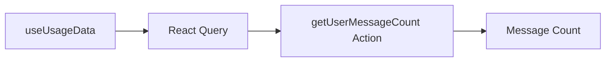
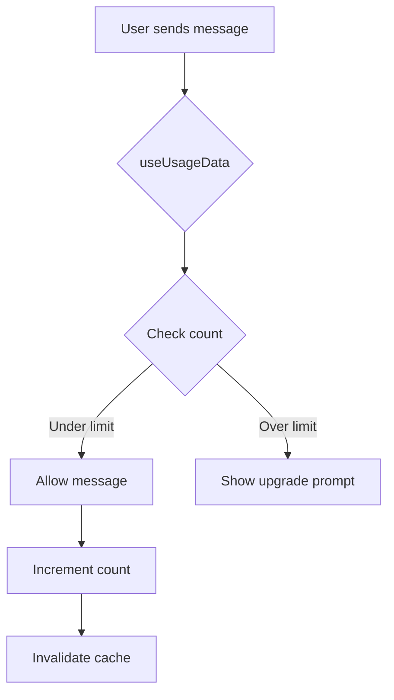
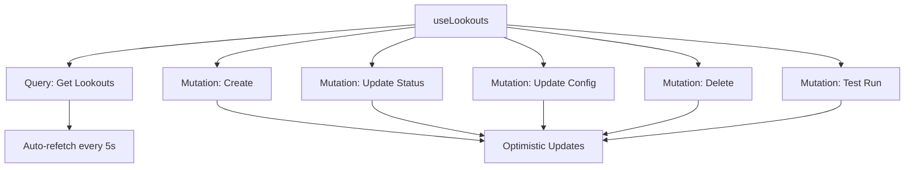
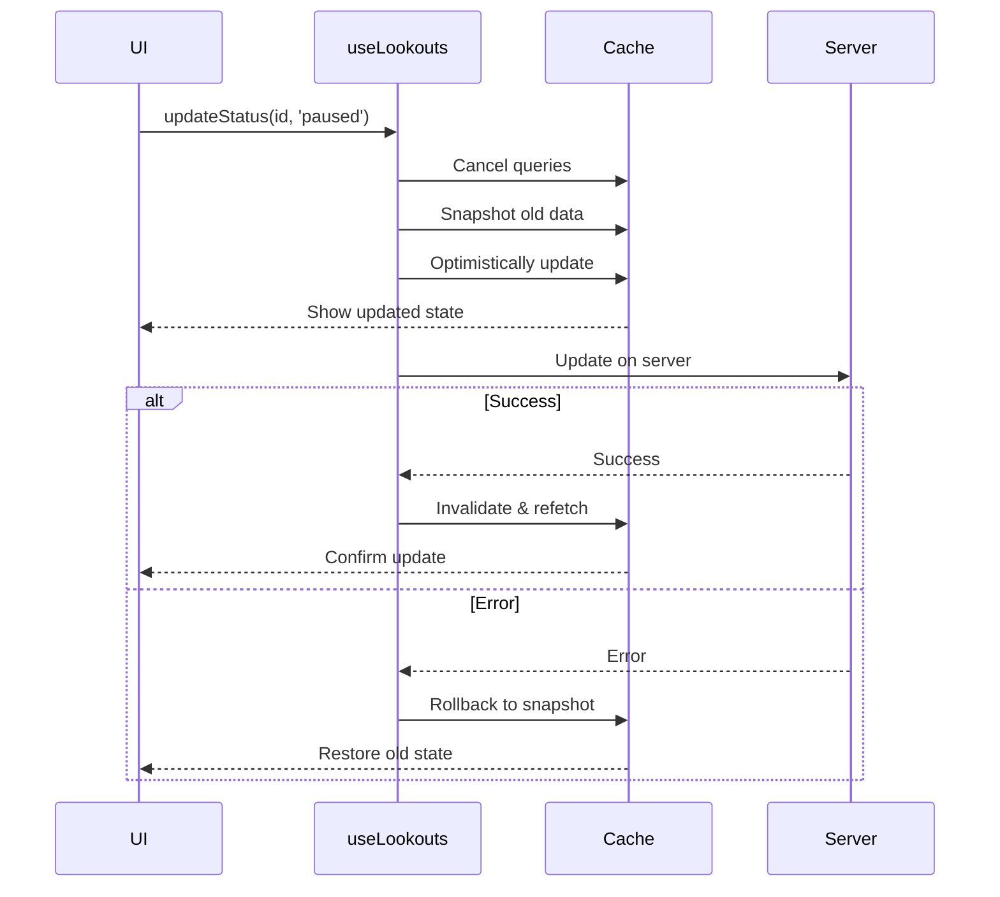
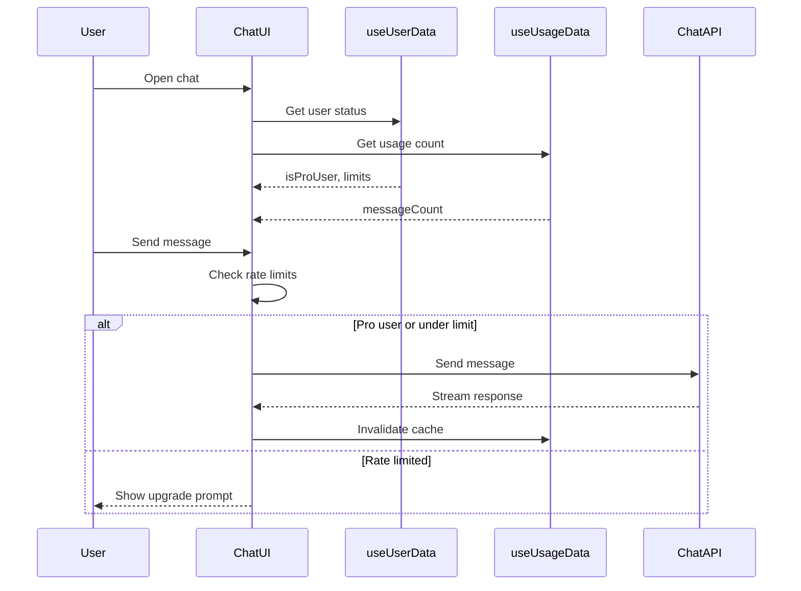
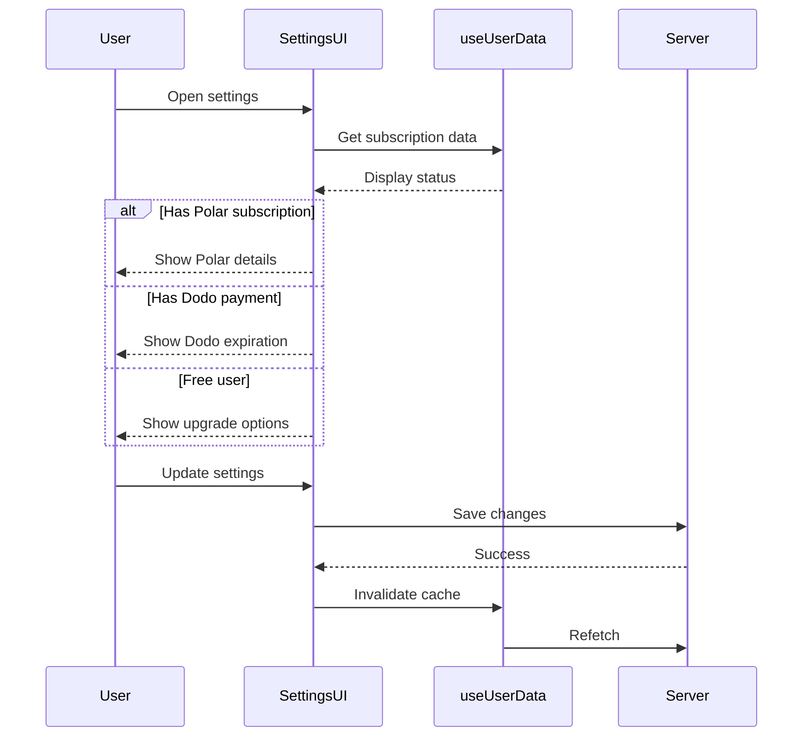
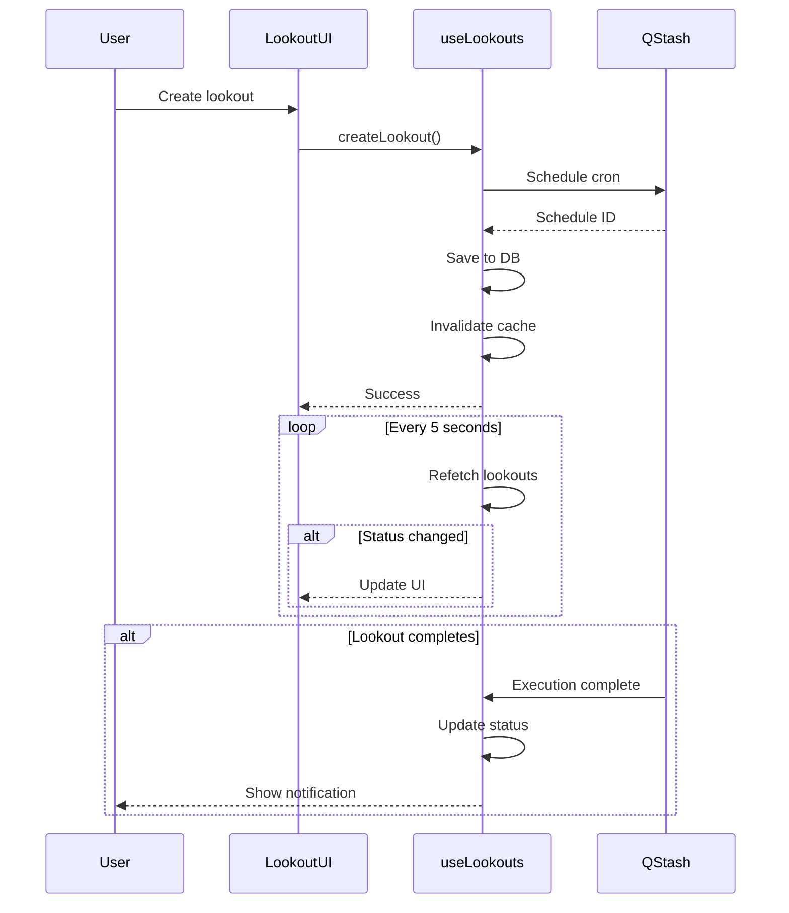

# UI Data Models

## Overview

This document describes the data models and state management patterns used in the UI layer of the Mylo Travel Concierge application. The UI leverages React Query (TanStack Query) for server state management and custom hooks for component-level data access.

## Architecture Overview



## Core Type System

### Message Types

```typescript
// Base message metadata
type MessageMetadata = {
  createdAt: string;
  model: string;
  completionTime: number | null;
  inputTokens: number | null;
  outputTokens: number | null;
  totalTokens: number | null;
};

// Data parts for streaming updates
type DataPart = { 
  type: 'append-message'; 
  message: string 
};

type DataQueryCompletionPart = {
  type: 'data-query_completion';
  data: {
    query: string;
    index: number;
    total: number;
    status: 'started' | 'completed' | 'error';
    resultsCount: number;
    imagesCount: number;
  };
};

type DataExtremeSearchPart = {
  type: 'data-extreme_search';
  data: 
    | { kind: 'plan'; status: { title: string }; plan?: Array<{ title: string; todos: string[] }> }
    | { kind: 'query'; queryId: string; query: string; status: 'started' | 'reading_content' | 'completed' | 'error' }
    | { kind: 'source'; queryId: string; source: { title: string; url: string; favicon?: string } }
    | { kind: 'content'; queryId: string; content: { title: string; url: string; text: string; favicon?: string } }
    | { kind: 'code'; codeId: string; title: string; code: string; status: 'running' | 'completed' | 'error'; result?: string; charts?: any[] }
    | { kind: 'x_search'; xSearchId: string; query: string; startDate: string; endDate: string; handles?: string[]; status: 'started' | 'completed' | 'error'; result?: {...} };
};

// Custom UI data types
type CustomUIDataTypes = {
  appendMessage: string;
  id: string;
  'message-annotations': any;
  query_completion: {...};
  extreme_search: DataExtremeSearchPart['data'];
};

// Complete chat message type
type ChatMessage = UIMessage<MessageMetadata, CustomUIDataTypes, ChatTools>;
```

### Tool Types

All AI tools are typed using `InferUITool` from the AI SDK:

```typescript
type ChatTools = {
  // Financial Tools
  stock_chart: stockChartTool;
  currency_converter: currencyConverterTool;
  coin_data: coinDataTool;
  coin_data_by_contract: coinDataByContractTool;
  coin_ohlc: coinOhlcTool;

  // Search & Content Tools
  x_search: xSearchTool;
  web_search: webSearch;
  academic_search: academicSearchTool;
  youtube_search: youtubeSearchTool;
  reddit_search: redditSearchTool;
  retrieve: retrieveTool;

  // Media & Entertainment
  movie_or_tv_search: movieTvSearchTool;
  trending_movies: trendingMoviesTool;
  trending_tv: trendingTvTool;

  // Location & Maps
  find_place_on_map: findPlaceOnMapTool;
  nearby_places_search: nearbyPlacesSearchTool;
  get_weather_data: weatherTool;

  // Utility Tools
  text_translate: textTranslateTool;
  code_interpreter: codeInterpreterTool;
  track_flight: flightTrackerTool;
  datetime: datetimeTool;
  extreme_search: extremeSearch;
  greeting: greetingTool;
  
  // Memory & Connectors
  connectors_search: createConnectorsSearchTool;
  search_memories: createMemoryTools;
  add_memory: addMemoryTools;
};
```

### Attachment Types

```typescript
interface Attachment {
  name: string;
  url: string;
  contentType?: string;
  mediaType?: string;
}
```

## React Query Hooks

### 1. useUserData Hook

**Purpose**: Centralized user data management with subscription and payment status.



**Query Configuration**:
```typescript
{
  queryKey: ['comprehensive-user-data'],
  queryFn: getCurrentUser,
  staleTime: 1000 * 60 * 30,  // 30 minutes
  gcTime: 1000 * 60 * 60,     // 1 hour
  refetchOnWindowFocus: false,
  retry: 2
}
```

**Returned Data**:
```typescript
{
  // Core
  user: ComprehensiveUserData | undefined,
  isLoading: boolean,
  error: Error | null,
  refetch: () => void,
  isRefetching: boolean,

  // Quick Access
  isProUser: boolean,
  proSource: 'polar' | 'dodo' | 'none',
  subscriptionStatus: 'active' | 'canceled' | 'expired' | 'none',

  // Polar Subscription
  polarSubscription: Subscription | undefined,
  hasPolarSubscription: boolean,

  // Dodo Payments
  dodoPayments: DodoPaymentStatus | undefined,
  hasDodoPayments: boolean,
  dodoExpiresAt: Date | undefined,
  isDodoExpiring: boolean,
  isDodoExpired: boolean,

  // Payment History
  paymentHistory: Payment[],

  // Rate Limiting
  shouldCheckLimits: boolean,
  shouldBypassLimitsForModel: (model: string) => boolean,

  // Subscription Checks
  hasActiveSubscription: boolean,
  isSubscriptionCanceled: boolean,
  isSubscriptionExpired: boolean,
  hasNoSubscription: boolean,

  // Legacy Compatibility
  subscriptionData: {...},
  dodoProStatus: {...},
  expiresAt: Date | undefined
}
```

**Lightweight Variants**:

```typescript
// For components that only need pro status
function useIsProUser() {
  const { isProUser, isLoading } = useUserData();
  return { isProUser, isLoading };
}

// For components that need subscription status
function useSubscriptionStatus() {
  const {
    subscriptionStatus,
    proSource,
    hasActiveSubscription,
    isSubscriptionCanceled,
    isSubscriptionExpired,
    hasNoSubscription,
    isLoading,
  } = useUserData();
  
  return {...};
}
```

**Data Flow**:


---

### 2. useUsageData Hook

**Purpose**: Track user's daily message count for rate limiting.



**Query Configuration**:
```typescript
{
  queryKey: ['user-usage', user?.id],
  queryFn: getUserMessageCount,
  enabled: enabled && !!user,
  staleTime: 1000 * 60 * 1,   // 1 minute
  gcTime: 1000 * 60 * 10,     // 10 minutes
  refetchOnWindowFocus: true
}
```

**Usage**:
```typescript
const { data: messageCount, isLoading } = useUsageData(user, true);
```

**Integration with Rate Limiting**:


---

### 3. useLookouts Hook

**Purpose**: Manage scheduled automated searches with real-time updates.



**Query Configuration**:
```typescript
{
  queryKey: ['lookouts', 'list'],
  queryFn: getUserLookouts,
  staleTime: 1000 * 2,          // 2 seconds
  refetchInterval: 1000 * 5,     // Poll every 5 seconds
  refetchIntervalInBackground: false,
  gcTime: 1000 * 30,            // 30 seconds
  refetchOnWindowFocus: true,
  refetchOnReconnect: true,
  refetchOnMount: true,
  retry: 3,
  structuralSharing: true
}
```

**Returned Data**:
```typescript
{
  // Data
  lookouts: Lookout[],
  isLoading: boolean,
  error: Error | null,
  lastUpdated: number,

  // Actions
  refetch: () => void,
  manualRefresh: () => Promise<void>,
  createLookout: (params) => void,
  updateStatus: (params) => void,
  updateLookout: (params) => void,
  deleteLookout: (params) => void,
  testLookout: (params) => void,

  // Loading States
  isCreating: boolean,
  isUpdatingStatus: boolean,
  isUpdating: boolean,
  isDeleting: boolean,
  isTesting: boolean,
  isPending: boolean  // Any mutation pending
}
```

**Lookout Type**:
```typescript
interface Lookout {
  id: string;
  title: string;
  prompt: string;
  frequency: 'once' | 'daily' | 'weekly' | 'monthly';
  timezone: string;
  nextRunAt: Date;
  status: 'active' | 'paused' | 'archived' | 'running';
  lastRunAt?: Date | null;
  lastRunChatId?: string | null;
  createdAt: Date;
  cronSchedule?: string;
}
```

**Optimistic Updates Pattern**:


**Completion Detection**:
```typescript
// Detects when lookout transitions from 'running' to 'active'/'paused'
React.useEffect(() => {
  const completedLookouts = lookouts.filter((current) => {
    const previous = previousLookouts.find(prev => prev.id === current.id);
    return (
      previous?.status === 'running' &&
      (current.status === 'active' || current.status === 'paused') &&
      current.lastRunAt !== previous.lastRunAt
    );
  });
  
  completedLookouts.forEach(lookout => {
    toast.success(`Lookout "${lookout.title}" completed!`);
  });
}, [lookouts]);
```

**Filtered Variant**:
```typescript
function useFilteredLookouts(filter: 'active' | 'archived' | 'all' = 'all') {
  const { lookouts, ...rest } = useLookouts();
  
  const filteredLookouts = lookouts.filter(lookout => {
    if (filter === 'active') 
      return ['active', 'paused', 'running'].includes(lookout.status);
    if (filter === 'archived') 
      return lookout.status === 'archived';
    return true;
  });
  
  return { lookouts: filteredLookouts, ...rest };
}
```

---

### 4. Query Key Factories

**Purpose**: Centralized query key management for cache invalidation.

```typescript
// Lookout keys
export const lookoutKeys = {
  all: ['lookouts'] as const,
  lists: () => [...lookoutKeys.all, 'list'] as const,
  list: (filters: string) => [...lookoutKeys.lists(), { filters }] as const,
  details: () => [...lookoutKeys.all, 'detail'] as const,
  detail: (id: string) => [...lookoutKeys.details(), id] as const,
};
```

**Benefits**:
- Type-safe query keys
- Easy cache invalidation
- Hierarchical key structure

**Usage**:
```typescript
// Invalidate all lookout queries
queryClient.invalidateQueries({ queryKey: lookoutKeys.all });

// Invalidate only list queries
queryClient.invalidateQueries({ queryKey: lookoutKeys.lists() });

// Invalidate specific lookout
queryClient.invalidateQueries({ queryKey: lookoutKeys.detail(id) });
```

---

## State Management Patterns

### 1. Server State (React Query)

**Used For**:
- User data
- Chat messages
- Usage statistics
- Lookouts
- Subscriptions

**Benefits**:
- Automatic caching
- Background refetching
- Optimistic updates
- Error handling
- Loading states

### 2. Local State (React useState)

**Used For**:
- Form inputs
- UI toggles (modals, dropdowns)
- Temporary selections
- Component-specific state

### 3. Context API

**Used For**:
- Theme settings
- Global UI preferences
- (Currently, contexts folder is empty - potential for future use)

---

## Data Fetching Strategies

### 1. On-Demand Fetching
```typescript
// User clicks, then fetch
const { data } = useQuery({
  queryKey: ['data'],
  queryFn: fetchData,
  enabled: false  // Manual trigger
});
```

### 2. Background Polling
```typescript
// Used for real-time updates (lookouts)
const { data } = useQuery({
  queryKey: ['lookouts'],
  queryFn: getLookouts,
  refetchInterval: 5000  // Poll every 5 seconds
});
```

### 3. Prefetching
```typescript
// Prefetch on hover
const queryClient = useQueryClient();

onMouseEnter={() => {
  queryClient.prefetchQuery({
    queryKey: ['chat', id],
    queryFn: () => getChatById(id)
  });
}}
```

### 4. Infinite Queries
```typescript
// For paginated data like chat history
const {
  data,
  fetchNextPage,
  hasNextPage,
  isFetchingNextPage
} = useInfiniteQuery({
  queryKey: ['chats'],
  queryFn: ({ pageParam = 0 }) => getChats(pageParam),
  getNextPageParam: (lastPage) => lastPage.nextCursor
});
```

---

## UI Component Data Flow

### Chat Interface Flow



### Settings Dialog Flow



### Lookout Manager Flow



---

## Type Safety & Validation

### Zod Schemas

```typescript
// Message metadata validation
export const messageMetadataSchema = z.object({
  createdAt: z.string(),
  model: z.string(),
  completionTime: z.number().nullable(),
  inputTokens: z.number().nullable(),
  outputTokens: z.number().nullable(),
  totalTokens: z.number().nullable(),
});

export type MessageMetadata = z.infer<typeof messageMetadataSchema>;
```

### Type Guards

```typescript
function isDataExtremeSearchPart(part: any): part is DataExtremeSearchPart {
  return part.type === 'data-extreme_search';
}

function isQueryCompletion(part: any): part is DataQueryCompletionPart {
  return part.type === 'data-query_completion';
}
```

---

## Performance Optimizations

### 1. Selective Re-renders
```typescript
// Only notify on specific prop changes
useQuery({
  queryKey: ['user'],
  queryFn: getUser,
  notifyOnChangeProps: ['data', 'error']  // Skip 'isLoading' updates
});
```

### 2. Structural Sharing
```typescript
// Prevent unnecessary re-renders when data structure is same
useQuery({
  queryKey: ['lookouts'],
  queryFn: getLookouts,
  structuralSharing: true  // Default, but explicit here
});
```

### 3. Debounced Updates
```typescript
// Prevent toast spam on rapid status changes
const recentCompletionsRef = useRef<Set<string>>(new Set());

if (!recentCompletionsRef.current.has(completionKey)) {
  recentCompletionsRef.current.add(completionKey);
  toast.success(`Lookout completed!`);
  
  setTimeout(() => {
    recentCompletionsRef.current.delete(completionKey);
  }, 30000);
}
```

### 4. Manual Cache Invalidation
```typescript
const manualRefresh = async () => {
  await queryClient.cancelQueries({ queryKey: lookoutKeys.lists() });
  await queryClient.invalidateQueries({ queryKey: lookoutKeys.lists() });
  return queryClient.refetchQueries({ queryKey: lookoutKeys.lists(), type: 'active' });
};
```

---

## Error Handling Patterns

### UI-Level Error Display

```typescript
const { data, error, isError } = useUserData();

if (isError) {
  return <ErrorBoundary error={error} />;
}
```

### Mutation Error Handling

```typescript
const mutation = useMutation({
  mutationFn: updateData,
  onError: (error) => {
    toast.error(error.message);
    // Rollback optimistic update
    queryClient.setQueryData(key, previousData);
  }
});
```

### Retry Configuration

```typescript
useQuery({
  queryKey: ['data'],
  queryFn: fetchData,
  retry: (failureCount, error) => {
    if (failureCount < 3) return true;
    return false;
  },
  retryDelay: (attemptIndex) => Math.min(1000 * 2 ** attemptIndex, 30000)
});
```

---

## Testing Strategies

### Mock React Query

```typescript
import { QueryClient, QueryClientProvider } from '@tanstack/react-query';

const queryClient = new QueryClient({
  defaultOptions: {
    queries: { retry: false },
    mutations: { retry: false }
  }
});

const wrapper = ({ children }) => (
  <QueryClientProvider client={queryClient}>
    {children}
  </QueryClientProvider>
);

// Test hook
const { result } = renderHook(() => useUserData(), { wrapper });
```

### Mock Server Actions

```typescript
jest.mock('@/app/actions', () => ({
  getCurrentUser: jest.fn(() => Promise.resolve(mockUser)),
  getUserMessageCount: jest.fn(() => Promise.resolve(5))
}));
```

---

## Related Documentation

- [Database Schema ERD](./database-schema.md)
- [Service Models](./service-models.md)
- [Type Definitions](../../lib/types.ts)
- [Custom Hooks](../../hooks/)
- [Server Actions](../../app/actions.ts)
