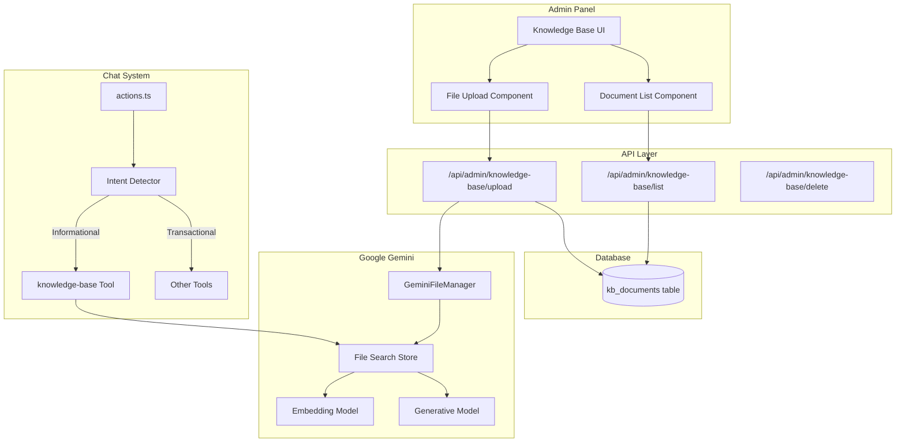
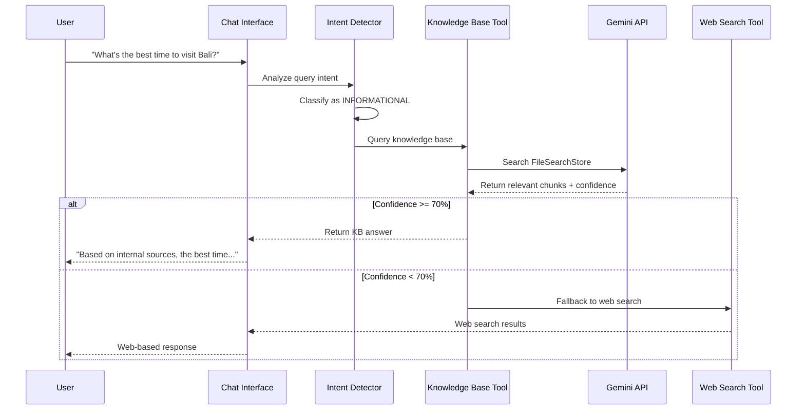
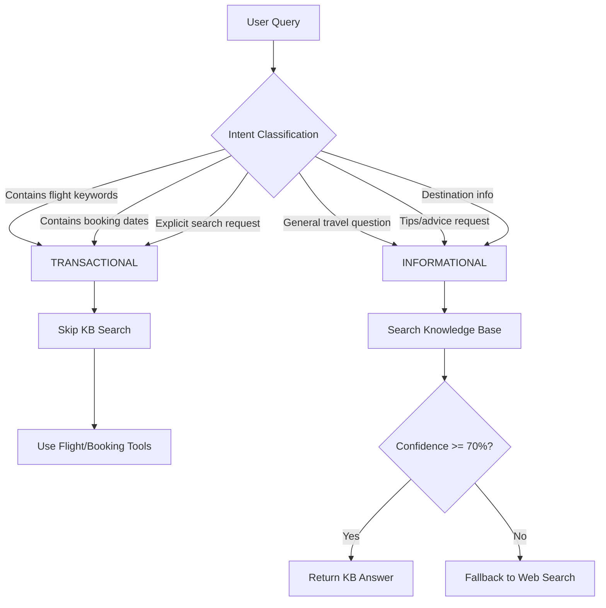

# Knowledge Base RAG System - Technical Specification

## 1. Overview

### 1.1 Purpose

Implement a complete Knowledge Base RAG (Retrieval-Augmented Generation) system that enables administrators to upload and manage documents, which are indexed using Google Gemini's File Search API for semantic search. The system integrates with the chat interface to provide knowledge-based answers for informational travel queries while excluding transactional requests like flight bookings.

### 1.2 Goals

1. Enable administrators to upload and manage knowledge base documents (PDF, Markdown, Text)
2. Index documents using Google Gemini File Search API for semantic retrieval
3. Integrate KB search into chat flow with proper intent detection
4. Seamless answer integration without explicit source citations
5. Support bulk file upload operations
6. Maintain a flat, centralized document structure accessible to all admins

### 1.3 Current State

The project already has a **partially implemented** Knowledge Base feature:

| Component | Status | Location |
|-----------|--------|----------|
| Admin UI (basic) | ✅ Implemented | `/app/admin/knowledge-base/page.tsx` |
| Gemini File Manager | ✅ Implemented | `/lib/gemini-file-manager.ts` |
| KB Tool | ✅ Implemented | `/lib/tools/knowledge-base.ts` |
| KB Query Function | ✅ Implemented | `/lib/tools/knowledge-base-query.ts` |
| API Routes | ✅ Implemented | `/app/api/admin/knowledge-base/*` |
| Intent Detection | ❌ Missing | Needs implementation |
| Bulk Upload | ❌ Missing | Needs implementation |
| Confidence Threshold | ❌ Missing | Needs implementation |
| FileSearchStore API | ❌ Not Used | Current uses older Files API |

### 1.4 Tech Stack

| Layer | Technology |
|-------|------------|
| Frontend | Next.js 15+ (App Router), React, Tailwind CSS |
| Database | PostgreSQL with Drizzle ORM |
| AI/ML | Google Gemini API (gemini-1.5-pro, gemini-embedding-001) |
| File Storage | Gemini File Storage (managed by Google) |
| Authentication | Custom auth system (via `/lib/auth-utils.ts`) |

> **Note**: The original spec incorrectly referenced Convex. This project uses **Drizzle ORM with PostgreSQL**.

---

## 2. Architecture

### 2.1 High-Level Architecture



### 2.2 Query Flow Architecture



### 2.3 Intent Detection Flow



---

## 3. Database Schema

### 3.1 New Table: `kb_documents`

Add to `/lib/db/schema.ts`:

```typescript
import { pgTable, text, timestamp, integer, boolean, json } from 'drizzle-orm/pg-core';
import { generateId } from 'ai';

/**
 * Knowledge Base document metadata table.
 * Stores metadata for documents uploaded to Gemini File Search.
 * Actual file content is stored in Gemini's managed storage.
 */
export const kbDocuments = pgTable('kb_documents', {
  id: text('id')
    .primaryKey()
    .$defaultFn(() => generateId()),
  
  // Gemini File Reference
  geminiFileName: text('gemini_file_name').notNull(), // e.g., "files/abc123"
  geminiFileUri: text('gemini_file_uri').notNull(),   // Full URI for API calls
  
  // Display metadata
  displayName: text('display_name').notNull(),
  originalFileName: text('original_file_name').notNull(),
  mimeType: text('mime_type').notNull(),
  sizeBytes: integer('size_bytes').notNull(),
  
  // Status tracking
  status: text('status', { 
    enum: ['uploading', 'processing', 'active', 'failed', 'archived'] 
  }).notNull().default('uploading'),
  statusMessage: text('status_message'),
  
  // Indexing metadata
  indexedAt: timestamp('indexed_at'),
  chunkCount: integer('chunk_count'),
  
  // Configuration
  confidenceThreshold: integer('confidence_threshold').default(70), // Per-document threshold
  
  // Audit fields
  uploadedBy: text('uploaded_by').references(() => user.id),
  createdAt: timestamp('created_at').notNull().defaultNow(),
  updatedAt: timestamp('updated_at').notNull().defaultNow(),
  deletedAt: timestamp('deleted_at'), // Soft delete
});

export type KBDocument = InferSelectModel<typeof kbDocuments>;
```

### 3.2 Migration SQL

```sql
-- Create kb_documents table
CREATE TABLE kb_documents (
  id TEXT PRIMARY KEY,
  gemini_file_name TEXT NOT NULL,
  gemini_file_uri TEXT NOT NULL,
  display_name TEXT NOT NULL,
  original_file_name TEXT NOT NULL,
  mime_type TEXT NOT NULL,
  size_bytes INTEGER NOT NULL,
  status TEXT NOT NULL DEFAULT 'uploading',
  status_message TEXT,
  indexed_at TIMESTAMP,
  chunk_count INTEGER,
  confidence_threshold INTEGER DEFAULT 70,
  uploaded_by TEXT REFERENCES "user"(id),
  created_at TIMESTAMP NOT NULL DEFAULT NOW(),
  updated_at TIMESTAMP NOT NULL DEFAULT NOW(),
  deleted_at TIMESTAMP
);

-- Index for active documents lookup
CREATE INDEX idx_kb_documents_status ON kb_documents(status) WHERE deleted_at IS NULL;

-- Index for Gemini file reference
CREATE INDEX idx_kb_documents_gemini_name ON kb_documents(gemini_file_name);
```

---

## 4. API Specification

### 4.1 Upload Endpoint (Enhanced)

**Path**: `POST /api/admin/knowledge-base/upload`

**Request**: `multipart/form-data`
- `files`: File[] (supports multiple files for bulk upload)

**Response**:
```typescript
interface UploadResponse {
  success: boolean;
  results: Array<{
    fileName: string;
    status: 'success' | 'error';
    documentId?: string;
    error?: string;
  }>;
}
```

**Implementation Notes**:
- Validate file type (PDF, MD, TXT only)
- Validate file size (10-20 MB limit)
- Upload to Gemini FileSearchStore
- Create metadata record in `kb_documents`
- Return document IDs for tracking

### 4.2 List Endpoint (Enhanced)

**Path**: `GET /api/admin/knowledge-base/list`

**Query Parameters**:
- `status`: Filter by status (optional)
- `page`: Pagination (default: 1)
- `limit`: Items per page (default: 20)

**Response**:
```typescript
interface ListResponse {
  documents: Array<{
    id: string;
    displayName: string;
    mimeType: string;
    sizeBytes: number;
    status: string;
    createdAt: string;
    indexedAt?: string;
  }>;
  pagination: {
    total: number;
    page: number;
    limit: number;
    hasMore: boolean;
  };
}
```

### 4.3 Delete Endpoint

**Path**: `POST /api/admin/knowledge-base/delete`

**Request**:
```typescript
interface DeleteRequest {
  documentIds: string[]; // Support bulk delete
}
```

**Response**:
```typescript
interface DeleteResponse {
  success: boolean;
  deletedCount: number;
  errors?: Array<{ id: string; error: string }>;
}
```

### 4.4 Query Endpoint (New)

**Path**: `POST /api/knowledge-base/query`

**Request**:
```typescript
interface QueryRequest {
  query: string;
  confidenceThreshold?: number; // Override default (70-75)
}
```

**Response**:
```typescript
interface QueryResponse {
  status: 'found' | 'not_found' | 'low_confidence' | 'error';
  answer?: string;
  confidence?: number;
  source?: 'internal'; // Generic indicator, no specific citation
}
```

---

## 5. Component Architecture

### 5.1 Admin UI Component Hierarchy

```
/app/admin/knowledge-base/
├── page.tsx                    # Main page (existing, to be enhanced)
├── components/
│   ├── DocumentUploader.tsx    # Bulk upload with drag-drop
│   ├── DocumentList.tsx        # Enhanced list with filters
│   ├── DocumentRow.tsx         # Individual document row
│   ├── StatusBadge.tsx         # Status indicator component
│   └── BulkActions.tsx         # Bulk select/delete actions
└── hooks/
    ├── useDocuments.ts         # Document fetching hook
    └── useUpload.ts            # Upload handling hook
```

### 5.2 DocumentUploader Component

```typescript
/**
 * DocumentUploader - Handles single and bulk file uploads
 * 
 * Features:
 * - Drag-and-drop support
 * - Multiple file selection
 * - File type validation
 * - Upload progress tracking
 * - Error handling per file
 */
interface DocumentUploaderProps {
  onUploadComplete: () => void;
  maxFiles?: number;         // Default: 10
  maxSizeBytes?: number;     // Default: 20MB
  acceptedTypes?: string[];  // Default: ['.pdf', '.md', '.txt']
}
```

### 5.3 DocumentList Component

```typescript
/**
 * DocumentList - Displays uploaded documents in a table
 * 
 * Features:
 * - Flat list (no categories per requirements)
 * - Status filtering
 * - Bulk selection
 * - Pagination
 * - Refresh functionality
 */
interface DocumentListProps {
  onRefresh: () => void;
  onDelete: (ids: string[]) => void;
}
```

---

## 6. Knowledge Base Tool Integration

### 6.1 Enhanced Knowledge Base Tool

Update `/lib/tools/knowledge-base.ts`:

```typescript
import { tool } from 'ai';
import { z } from 'zod';
import { queryKnowledgeBase } from './knowledge-base-query';

export const knowledgeBaseTool = tool({
  description: `Search the internal Knowledge Base for travel-related information.
  
  USE THIS TOOL FOR:
  - General travel tips and advice
  - Destination information
  - Travel policies and guidelines
  - FAQs about travel services
  
  DO NOT USE THIS TOOL FOR:
  - Flight searches with specific dates/destinations
  - Booking requests
  - Price queries for specific routes
  - Any transactional queries
  
  This tool searches internal documents first. If no relevant information is found,
  the system will automatically fall back to web search.`,

  inputSchema: z.object({
    query: z.string().describe('The travel-related question to search for'),
  }),

  execute: async ({ query }: { query: string }) => {
    try {
      const result = await queryKnowledgeBase(query, {
        confidenceThreshold: 0.70, // 70% default, configurable
      });

      if (result.status === 'found' && result.confidence >= 0.70) {
        // Return answer without explicit source citation
        return result.answer;
      }

      if (result.status === 'low_confidence') {
        return '__KB_LOW_CONFIDENCE__'; // Signal to fallback
      }

      return '__KB_NOT_FOUND__'; // Signal to fallback
    } catch (error) {
      console.error('Knowledge Base search error:', error);
      return '__KB_ERROR__';
    }
  },
});
```

### 6.2 Intent Detection Logic

Add `/lib/utils/intent-detector.ts`:

```typescript
/**
 * Intent Detector - Classifies user queries as informational or transactional
 * 
 * TRANSACTIONAL indicators:
 * - Flight/booking keywords with dates
 * - Price queries with specific routes
 * - Booking/reservation requests
 * 
 * INFORMATIONAL indicators:
 * - Questions about destinations
 * - Travel tips/advice requests
 * - General travel information
 */

export type QueryIntent = 'transactional' | 'informational' | 'ambiguous';

interface IntentResult {
  intent: QueryIntent;
  confidence: number;
  signals: string[];
}

const TRANSACTIONAL_PATTERNS = [
  // Flight-specific with dates
  /\b(fl[uü]g|flight|fliegen|fly)\b.*\b\d{1,2}[\./]\d{1,2}/i,
  // Booking requests
  /\b(buchen|book|reserv|bestell)\b/i,
  // Price queries with routes
  /\b(preis|price|cost|kosten)\b.*\b(von|from|nach|to)\b/i,
  // Direct flight search requests
  /\b(such|find|zeig|show)\b.*\b(fl[uü]g|flight)\b.*\b(von|from|nach|to)\b/i,
  // Date patterns with travel context
  /\b(am|on|für|for)\b\s+\d{1,2}[\./]\d{1,2}/i,
];

const INFORMATIONAL_PATTERNS = [
  // Tips and advice
  /\b(tipp|tip|rat|advice|empfehl|recommend)\b/i,
  // Best time questions
  /\b(beste zeit|best time|wann.*reisen|when.*travel)\b/i,
  // General destination info
  /\b(was.*wissen|what.*know|inform|über|about)\b/i,
  // How-to questions
  /\b(wie|how|was muss|what should)\b/i,
];

export function detectIntent(query: string): IntentResult {
  const signals: string[] = [];
  let transactionalScore = 0;
  let informationalScore = 0;

  // Check transactional patterns
  for (const pattern of TRANSACTIONAL_PATTERNS) {
    if (pattern.test(query)) {
      transactionalScore += 1;
      signals.push(`transactional: ${pattern.source}`);
    }
  }

  // Check informational patterns
  for (const pattern of INFORMATIONAL_PATTERNS) {
    if (pattern.test(query)) {
      informationalScore += 1;
      signals.push(`informational: ${pattern.source}`);
    }
  }

  // Determine intent
  const totalScore = transactionalScore + informationalScore;
  
  if (transactionalScore > informationalScore && transactionalScore >= 2) {
    return {
      intent: 'transactional',
      confidence: transactionalScore / Math.max(totalScore, 1),
      signals,
    };
  }
  
  if (informationalScore > transactionalScore || totalScore === 0) {
    return {
      intent: 'informational',
      confidence: informationalScore / Math.max(totalScore, 1),
      signals,
    };
  }

  return {
    intent: 'ambiguous',
    confidence: 0.5,
    signals,
  };
}
```

### 6.3 Chat System Integration

Update the system prompt in `/app/actions.ts` for the `web` group:

```typescript
// Add to groupInstructions.web, after the existing knowledge_base instructions:

#### Knowledge Base Search Scope (CRITICAL):
- ⚠️ BEFORE calling knowledge_base, check the query intent:
  - SKIP KB for: flight searches with dates, booking requests, price queries
  - USE KB for: travel tips, destination info, general advice, FAQs
- Intent signals for SKIPPING KB:
  - Contains specific dates (e.g., "15.12", "March 2025")
  - Contains route info + price/booking keywords
  - Explicit flight search requests
- When in doubt for general travel questions, TRY KB first
- If KB returns NOT_FOUND or low confidence, proceed to web_search
```

---

## 7. Gemini File Search Integration

### 7.1 Upgrade to FileSearchStore API

The current implementation uses the older Gemini Files API. Upgrade to the new FileSearchStore API for better RAG performance:

```typescript
// lib/gemini-file-search-store.ts

import { GoogleGenerativeAI } from '@google/generative-ai';

const genAI = new GoogleGenerativeAI(process.env.GOOGLE_GENERATIVE_AI_API_KEY!);

/**
 * GeminiFileSearchStore - Manages document indexing and retrieval
 * using Gemini's FileSearchStore API.
 */
export class GeminiFileSearchStore {
  private storeName: string;

  constructor(storeName: string = 'mylo-knowledge-base') {
    this.storeName = storeName;
  }

  /**
   * Upload and index a file in the FileSearchStore
   */
  async uploadFile(
    filePath: string,
    displayName: string,
    mimeType: string
  ): Promise<{ fileName: string; uri: string }> {
    // Implementation using Gemini FileSearchStore API
    // Automatically handles chunking, embedding, and indexing
  }

  /**
   * Query the FileSearchStore with semantic search
   */
  async query(
    query: string,
    options: { maxResults?: number; confidenceThreshold?: number }
  ): Promise<QueryResult> {
    const model = genAI.getGenerativeModel({ model: 'gemini-2.5-flash' });
    
    const response = await model.generateContent({
      contents: [{ role: 'user', parts: [{ text: query }] }],
      tools: [{
        fileSearch: {
          fileSearchStoreNames: [this.storeName],
        },
      }],
    });

    // Parse response with grounding metadata for citations
    return this.parseResponse(response);
  }

  /**
   * Delete a file from the FileSearchStore
   */
  async deleteFile(fileName: string): Promise<void> {
    // Implementation
  }

  /**
   * List all files in the FileSearchStore
   */
  async listFiles(): Promise<FileMetadata[]> {
    // Implementation
  }
}
```

### 7.2 Chunking Configuration

For optimal retrieval, configure chunking:

```typescript
const chunkingConfig = {
  whiteSpaceConfig: {
    maxTokensPerChunk: 512,  // Optimal for travel docs
    maxOverlapTokens: 50,    // Context preservation
  },
};
```

---

## 8. Error Handling

### 8.1 Error Types

```typescript
export enum KBErrorCode {
  UPLOAD_FAILED = 'KB_UPLOAD_FAILED',
  INVALID_FILE_TYPE = 'KB_INVALID_FILE_TYPE',
  FILE_TOO_LARGE = 'KB_FILE_TOO_LARGE',
  INDEXING_FAILED = 'KB_INDEXING_FAILED',
  QUERY_FAILED = 'KB_QUERY_FAILED',
  DELETE_FAILED = 'KB_DELETE_FAILED',
  GEMINI_API_ERROR = 'KB_GEMINI_API_ERROR',
  RATE_LIMITED = 'KB_RATE_LIMITED',
}

export class KBError extends Error {
  constructor(
    public code: KBErrorCode,
    message: string,
    public details?: unknown
  ) {
    super(message);
    this.name = 'KBError';
  }
}
```

### 8.2 Error Handling Strategy

| Scenario | Action |
|----------|--------|
| Upload fails | Retry once, then show error in UI |
| Indexing times out | Mark as 'processing', poll for status |
| Query returns error | Fallback to web search |
| Gemini rate limit | Queue request, retry with backoff |
| Invalid file type | Immediate rejection with clear message |
| File too large | Immediate rejection with size limit info |

---

## 9. Configuration

### 9.1 Environment Variables

```env
# Gemini API
GOOGLE_GENERATIVE_AI_API_KEY=your-api-key

# Knowledge Base Configuration
KB_MAX_FILE_SIZE_MB=20
KB_CONFIDENCE_THRESHOLD=70
KB_FILE_SEARCH_STORE_NAME=mylo-knowledge-base
KB_SUPPORTED_MIME_TYPES=application/pdf,text/plain,text/markdown
```

### 9.2 Runtime Configuration

```typescript
// lib/config/knowledge-base.ts

export const KB_CONFIG = {
  maxFileSizeMB: parseInt(process.env.KB_MAX_FILE_SIZE_MB || '20'),
  confidenceThreshold: parseInt(process.env.KB_CONFIDENCE_THRESHOLD || '70') / 100,
  supportedMimeTypes: [
    'application/pdf',
    'text/plain',
    'text/markdown',
  ],
  fileSearchStoreName: process.env.KB_FILE_SEARCH_STORE_NAME || 'mylo-knowledge-base',
  maxBulkUploadFiles: 10,
  queryTimeoutMs: 10000,
};
```

---

## 10. Implementation Phases

### Phase 1: Foundation (Week 1)

| Task | Priority | Effort |
|------|----------|--------|
| Create `kb_documents` database table | High | 2h |
| Add database queries in `/lib/db/queries.ts` | High | 3h |
| Update GeminiFileManager for FileSearchStore | High | 4h |
| Implement bulk upload API | Medium | 4h |
| Unit tests for new functions | High | 4h |

**Deliverables**:
- Database schema migration
- Enhanced file manager
- Bulk upload capability

### Phase 2: Admin UI Enhancement (Week 2)

| Task | Priority | Effort |
|------|----------|--------|
| Implement DocumentUploader with drag-drop | High | 4h |
| Implement DocumentList with pagination | High | 3h |
| Add bulk selection/delete | Medium | 2h |
| Add status indicators and refresh | Medium | 2h |
| Responsive design adjustments | Low | 2h |

**Deliverables**:
- Enhanced admin interface
- Bulk operations support
- Improved UX

### Phase 3: Intent Detection & RAG Integration (Week 3)

| Task | Priority | Effort |
|------|----------|--------|
| Implement intent detector | High | 4h |
| Update knowledge-base tool | High | 3h |
| Integrate into chat system prompts | High | 3h |
| Add confidence threshold logic | Medium | 2h |
| Implement fallback to web search | Medium | 2h |

**Deliverables**:
- Smart query routing
- Confidence-based responses
- Seamless fallback

### Phase 4: Testing & Polish (Week 4)

| Task | Priority | Effort |
|------|----------|--------|
| End-to-end testing | High | 6h |
| Performance optimization | Medium | 4h |
| Error handling refinement | Medium | 3h |
| Documentation | Low | 2h |
| Bug fixes | High | Varies |

**Deliverables**:
- Production-ready feature
- Comprehensive tests
- Documentation

---

## 11. Success Criteria

### 11.1 Functional Requirements

- [ ] Admins can upload PDF, MD, TXT files (single and bulk)
- [ ] Files are indexed in Gemini FileSearchStore
- [ ] Documents appear in admin list with status
- [ ] Documents can be deleted (single and bulk)
- [ ] KB is queried for informational travel questions
- [ ] KB is skipped for transactional queries (flights, bookings)
- [ ] Answers are presented seamlessly (no explicit citations)
- [ ] Low-confidence responses fall back to web search

### 11.2 Technical Requirements

- [ ] File upload validation (type, size)
- [ ] Database records track all document metadata
- [ ] Intent detection accuracy > 85%
- [ ] Query response time < 2 seconds
- [ ] Proper error handling with user-friendly messages
- [ ] Code follows project conventions (< 600 lines/file)

### 11.3 UX Requirements

- [ ] Upload shows progress indicator
- [ ] Status badges clearly indicate document state
- [ ] Bulk operations are intuitive
- [ ] Chat responses feel natural and helpful
- [ ] Error states provide actionable guidance

---

## 12. Related Documentation

- [Flight Search Feature](/documentation/features/flight-search.md)
- [Gemini File Search API](https://ai.google.dev/gemini-api/docs/file-search)
- [Project Database Schema](/lib/db/schema.ts)
- [Tool System](/lib/tools/index.ts)
- [Chat Actions](/app/actions.ts)

---

## Document History

| Date | Author | Changes |
|------|--------|---------|
| 2025-11-25 | Spec Writer | Comprehensive technical specification |

---

## Appendix A: Existing Code References

### Current Admin Page Location
`/app/admin/knowledge-base/page.tsx` - Basic implementation with single file upload

### Current Tool Implementation
`/lib/tools/knowledge-base.ts` - Uses older Gemini Files API approach

### Current File Manager
`/lib/gemini-file-manager.ts` - Wrapper around GoogleAIFileManager

### Chat System Integration Point
`/app/actions.ts` - `groupInstructions.web` contains KB tool instructions
